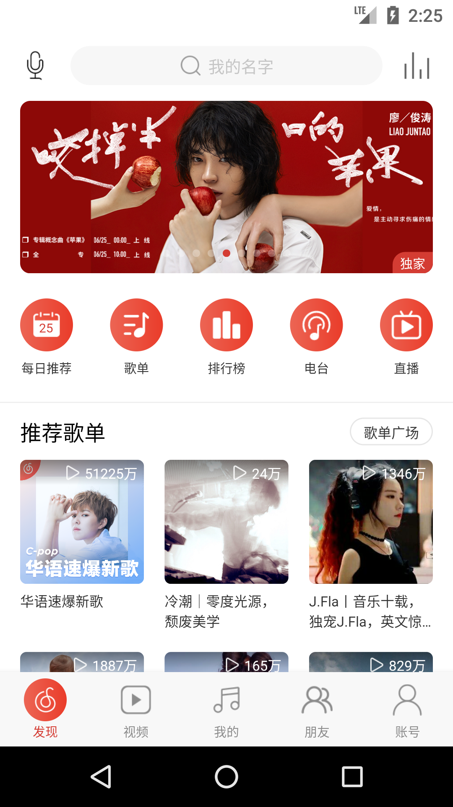
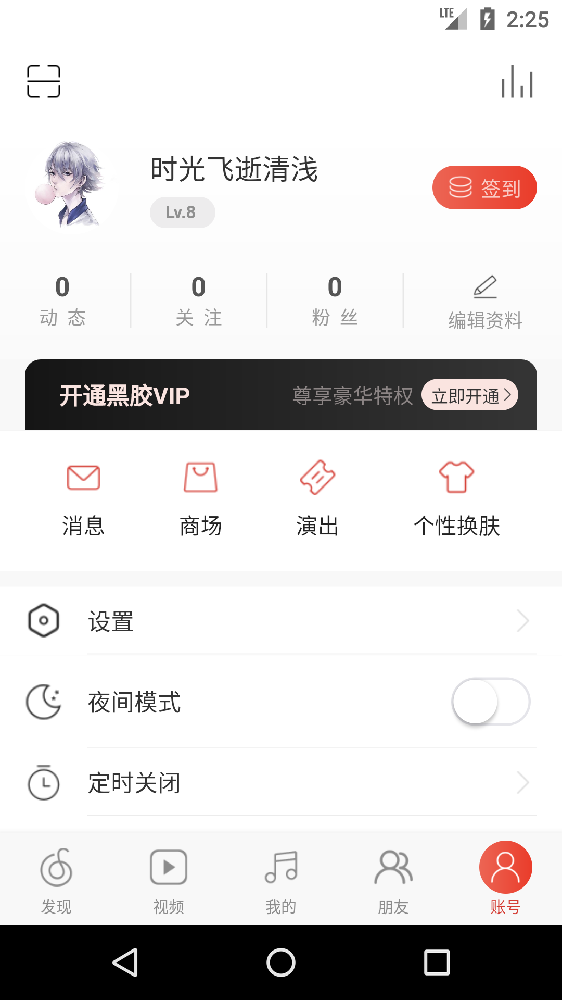

# flutter_netease_cloud

A new Flutter project.利用Flutter高仿网易云音乐APP，后端接口主要参考[网易云音乐NodeJS版API](https://binaryify.github.io/NeteaseCloudMusicApi)

## 预览

## 命令
`flutter packages pub run build_runner build`

## flutter_bloc
### Core Concepts
#### Events
> Events are the input to a Bloc. They are commonly dispatched in response to user interactions such as button presses or lifecycle events like page loads.

#### States
> States are the output of a Bloc and represent a part of your application's state. UI components can be notified if states and redraw portions of themeselves based on the current state.

#### Bloc
> a Bloc(Business Logic Component) is a component which converts a `Stream` of incoming `Events` into a `Stream` of outgoing `States`. Think of a Bloc as being the "brains" described above.

## 清单

* [x] 引导页和闪屏页，[flutter_swiper](https://pub.flutter-io.cn/packages/flutter_swiper)
* [x] 路由导航，[fluro](https://pub.flutter-io.cn/packages/fluro)
* [x] 数据持久化，[shared_preferences](https://pub.flutter-io.cn/packages/shared_preferences)
* [x] Http请求，[dio](https://pub.flutter-io.cn/packages/dio)
* [ ] 全局状态管理，[Provider](https://pub.flutter-io.cn/packages/provider)
* [ ] json序列化，`json_serializable`，`json_annotation`，`build_runner`
* [ ] 离线缓存，[sqflite](https://pub.flutter-io.cn/packages/sqflite)
* [ ] 音乐播放
* [ ] 视频播放
* [ ] 个性皮肤
* [ ] 待续...